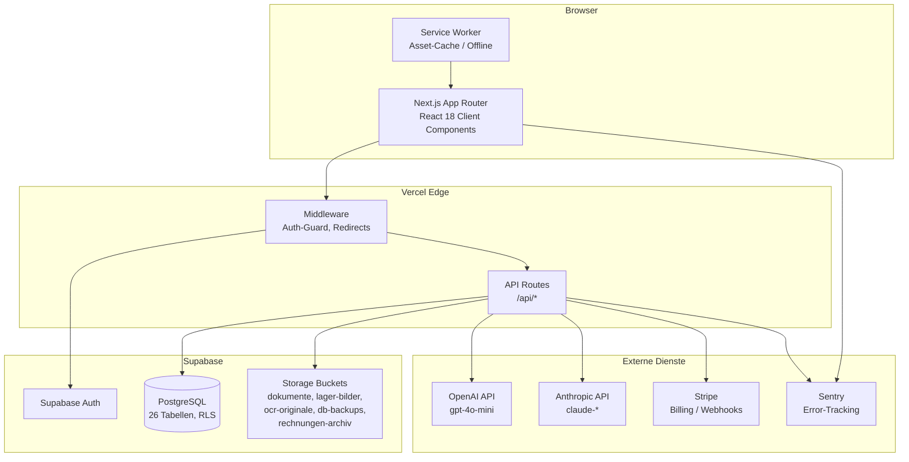
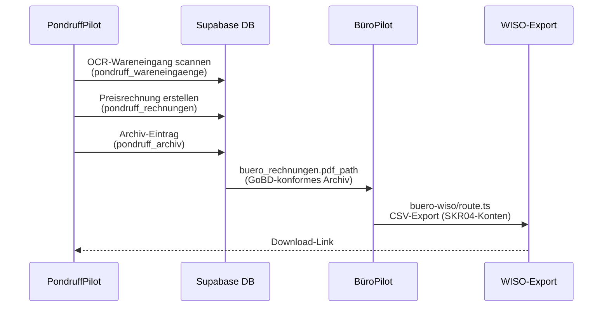

# ARCHITECTURE.md — Petersen KI Betriebssteuerung

## System-Diagramm



---

## Daten-Flow: Pondruff → Büro → WISO



---

## RLS-Modell (Row-Level Security)

Jede Tabelle hat `user_id uuid references auth.users default auth.uid()`.

```sql
-- Muster-Policy (alle Tabellen gleich aufgebaut):
CREATE POLICY "user_only" ON tabelle
  USING (auth.uid() = user_id)
  WITH CHECK (auth.uid() = user_id);
```

**Ausnahmen:**
- `db-backups` Bucket: nur Service-Role-Zugriff (kein anon/auth-Zugriff)
- `rechnungen-archiv` Bucket: kein DELETE für anon/auth (GoBD-Unveränderlichkeit)
- Owner-Tabellen (`firma_einstellungen`, `firma_users`): zusätzliche Admin-Only-Checks

**Rollen** (`lib/roles.ts`):
| Rolle | Lesen | Erstellen | Bearbeiten | Löschen | Export |
|---|---|---|---|---|---|
| Admin | ✅ | ✅ | ✅ | ✅ | ✅ |
| Mitarbeiter | ✅ | ✅ | ✅ | — | — |
| Büro | ✅ | — | — | — | ✅ |
| Werkstatt | ✅ | — | — | — | — |
| Lager | ✅ | — | — | — | — |

---

## Backup-Strategie

```mermaid
graph LR
    CRON[Vercel CRON<br/>täglich 02:00 UTC]
    API[/api/backup/auto<br/>CRON_SECRET Auth]
    DB[(Supabase<br/>26 Tabellen)]
    GZ[JSON.gz<br/>gzipSync]
    S3[db-backups Bucket<br/>user_id/YYYY-MM-DD.json.gz]
    OLD[Backups älter 30 Tage<br/>automatisch gelöscht]

    CRON --> API
    API --> DB
    DB --> GZ
    GZ --> S3
    S3 --> OLD
```

- **Format:** vollständiger JSON-Dump aller 26 User-Tabellen, gzip-komprimiert
- **Speicherpfad:** `db-backups/<user_id>/<datum>.json.gz`
- **Retention:** 30 Tage (ältere Backups werden beim nächsten CRON gelöscht)
- **Tabelle:** `cloud_backups` mit `storage_path` + `size_bytes` für UI-Anzeige
- **Restore:** manuell via Supabase Storage → JSON extrahieren → SQL-Import

---

## Datei-Struktur (Übersicht)

```
app/
├── dashboard/
│   ├── layout.tsx          Auth-Guard, Sidebar, Bottom-Nav, Error Boundary
│   ├── page.tsx            Dashboard-Übersicht
│   ├── [pilot]/
│   │   ├── page.tsx        Pilot-Hauptseite
│   │   └── loading.tsx     Loading-Skeleton (Next.js Suspense)
│   └── pondruff/           Pondruff-Spezialpilot (eigenes Layout)
├── api/
│   ├── chat/               Anthropic KI-Chat (SSE-Streaming)
│   ├── backup/auto/        Nightly DB-Backup
│   ├── openai/             GPT-4o-mini Tools (Mahnung, E-Mail, Steuerprognose...)
│   ├── pondruff/           Pondruff-spezifische Routes (OCR, Preisrechner)
│   └── owner/              Owner-only Routes (User-Mgmt, OpenAI-Costs)
└── (auth)/                 Login, Register, Freischaltung

components/
├── ErrorBoundary.tsx       React Error Boundary (Sentry-Report)
├── ui/
│   ├── PilotSkeleton.tsx   Wiederverwendbarer Loading-Skeleton
│   └── SkeletonCard.tsx    Basis-Skeleton-Bausteine
├── Sidebar.tsx             Desktop-Navigation
├── GlobalSearch.tsx        ⌘K Suchmodal
├── NotificationBell.tsx    Live-Warnungen
└── pondruff/               Pondruff-spezifische Komponenten

lib/
├── db.ts                   Zentrale Datenschicht (Supabase CRUD, ~3000 Zeilen)
├── db/_shared.ts           Shared Helpers/Types (Soft-Split)
├── supabase.ts             Supabase Client Setup
├── auth.ts                 Demo-Cookie, Auth-Helpers
├── roles.ts                Rollen-System + Permissions
├── pdf.ts                  jsPDF (Rechnungen, Angebote, Analyse, Lager)
├── pondruff.ts             Pondruff-Preisberechnung
├── pondruff-ocr.ts         OCR-Helpers (konsolidiert)
├── image-compress.ts       WebP-Kompression (max 1600px)
├── demo.ts                 Demo-Mode Helpers (ifLive, skipInDemo)
└── lager-helpers.ts        mhdStatus, getBestStellplatz

supabase/
└── migrations/             Chronologische SQL-Migrations (YYYYMMDDHHMMSS_name.sql)
```

---

## Kritische Pfade / Performance

| Route | Strategie |
|---|---|
| `/dashboard/*` | Static Shell + Client-side Supabase-Queries |
| `/api/chat` | SSE-Streaming (keine Timeout-Limitierung) |
| `/api/backup/auto` | Vercel CRON, 10min Timeout |
| Bilder | WebP-Kompression vor Upload, Signed URLs (1h TTL) |
| DB-Queries | 23 Indexes auf Haupttabellen (Migration `20260519100000`) |
| Tab-Loading | Lazy-Loading (nur aktiver Tab lädt Daten) |

---

## ADR: API-Versionierung

**Status:** akzeptiert (2026-05-19)

**Entscheidung:** API-Routen werden ab sofort versioniert über `/api/v1/*`-Aliase erreichbar gemacht.

**Setup:**
- `next.config.js` enthält Rewrite `/api/v1/:path*` → `/api/:path*`
- Bestehende Routen unter `/api/*` bleiben unverändert (keine Breaking-Changes)
- Neue Clients sollten `/api/v1/*` ansprechen
- Bei künftigen Breaking-Changes: neue Implementierung unter `app/api/v2/`, alte Route bleibt für N Releases

**Vorteile:**
- Bestehende Integrationen (Frontend, externe Pondruff-Sync) brechen nicht
- Klare Migrationsstrategie für Breaking-Changes
- Versionsbewusste Clients können `Accept-Version`-Konvention nutzen

**Wann v2 anlegen:**
- Response-Format-Änderungen (Felder umbenennen/entfernen)
- Auth-Modell wechseln
- Status-Code-Semantik ändern

**Nicht zwingend versionieren:**
- Neue Felder in Response (additive Änderungen sind backward-kompatibel)
- Neue Routen (einfach unter `/api/v1/neueRoute` anlegen)
- Performance-Optimierungen ohne Schnittstellenänderung
